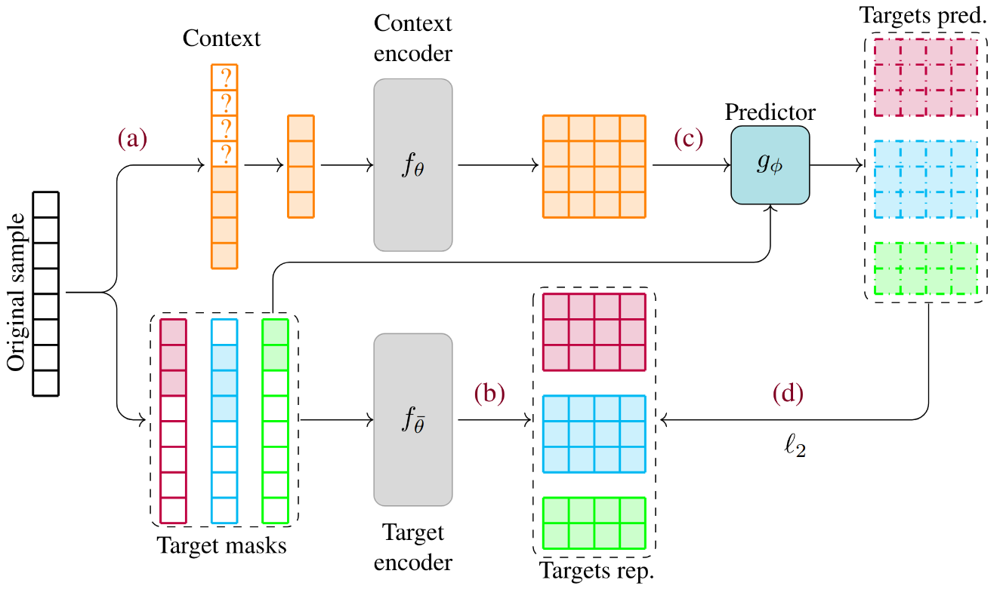

# T-JEPA

T-JEPA leverages a Joint Embedding Predictive Architecture (JEPA) that predicts the latent representation of one subset of features from the latent representation of another subset within the same sample, avoiding the need for augmentations. This approach significantly improves both classification and regression tasks, even surpassing models trained in the original data space and outperforming traditional methods such as Gradient Boosted Decision Trees on some datasets.

Our experimental results show that T-JEPA learns effective representations without labels, identifies relevant features for downstream tasks, and introduces a **novel regularization technique** called **regularization tokens**, essential for training JEPA-based models on structured data.

### Contributions

- Introduction of **T-JEPA**, a novel **augmentation-free** SSL method for tabular data.
- Substantial performance improvement in classification and regression tasks.
- Deep methods augmented by T-JEPA consistently outperform or match Gradient Boosted Decision Trees.
- Extensive characterization of learned representations, explaining the improvement in supervised tasks.
- Discovery of **regularization tokens**, a new method critical for avoiding collapsed training regimes.

## Method Overview



As presented in the Figure, T-JEPA uses three main modules to learn representations: 
1. **Context Encoder**
2. **Target Encoder**
3. **Prediction Module**

The goal is to predict the latent representation of one subset of features from another subset within the same sample.

Let:
- **x** ∈ 𝓧 ⊆ ℝ^d represent a sample with d features (numerical or categorical),
- **h** denote the hidden dimension of the transformer encoders,
- **fθ** be the context encoder,
- **fθ'** the target encoder, and
- **gφ** the prediction module.

The prediction is made using the context encoder, while the target encoder constructs the representations to be predicted.

## Code Structure
The repository is structured as follows:

```
.
├── benchmark.py                # Main script to run benchmark experiments on Deep Leanring models
├── datasets                    # Default dataset folder
├── LICENSE                     
├── README.md                   
├── requirements.txt            # Python dependencies
├── results                     # Stores benchmark results for different models and datasets
│   ├── adult_AD
│   │   ├── autoint
│   │   ├── dcnv2
│   │   ├── ft_transformer
│   │   ├── mlp
│   │   └── resnet
│   ├── aloi_AL
│   ├── california_CA
│   ├── helena_HE
│   ├── higgs_HI
│   └── jannis_JA
├── run_benchmark.py            # Script to execute benchmarks on multiple datasets
├── run.py                      # Main entry point for T-JEPA training and evaluation
├── scripts                     
│   ├── bench_random_seed       # Script to run DL models with random seeds
│   ├── launch_tjepa.sh         # Script to launch T-JEPA training
│   └── tjepa_tuning            # Script to tune T-JEPA hyperparameters
├── src                         # Core source code including models, datasets, and utilities
│   ├── benchmark
│   ├── configs.py
│   ├── datasets
│   ├── encoder.py
│   ├── models
│   ├── predictors.py
│   ├── tjepa_transformer.py
│   ├── torch_dataset.py
│   ├── train.py
│   └── utils
```

This structure highlights the core components of the project at a glance.

## Installation

1. Install dependencies.
    ```bash
    pip install -r requirements.txt
    ```

LICENSE: <i>by downloading our dataset you accept licenses of all its components. We do not impose any new restrictions in addition to those licenses. You can find the list of sources in the section "References" of the paper.</i>

2. Download the datasets.
    ```bash
    ./datasets/download_data.sh
    ```

## Launching T-JEPA pretraining

To launch the T-JEPA pretraining, you can use the provided `launch_tjepa.sh` script. This script will check for Python installation and allow you to configure various parameters for running the pretraining process.

### Usage:

```bash
./launch_tjepa.sh [options]
```

For example, to launch T-JEPA with the "jannis" dataset:
```bash
./scripts/launch_tjepa.sh --data_path ./datasets --data_set jannis
```

### Options:

- `--data_path`: Path to the datasets (default: `./datasets`)
- `--data_set`: Dataset name (default: `jannis`)

To display help, run the script with `-h` or `--help`.


## Launching benchmark of Deep Learning models

The general structure of the benchmarking script is as follows:

```bash
python benchmark.py --config_file=<JSON config file of the model> --num_runs=<num_runs>
```

For example, to use the "helena" dataset with an MLP model:

```bash
python benchmark.py --config_file=src/benchmark/tuned_config/jannis/mlp_jannis_tuned.json --num_runs=1
```

### Configuration Files

The configuration files are located in the following directory:
```
src/benchmark/tuned_config/<dataset>/*
```
Each configuration file follows the naming convention:
```
<model>_<dataset>_tuned.json
```

## Results


| Model          | AD ↑     | HE ↑     | JA ↑     | AL ↑     | CA ↓     | HI ↑     | Wins |
|----------------|----------|----------|----------|----------|----------|----------|------|
| **Baseline Neural Networks** |          |          |          |          |          |          |      |
| MLP            | 0.825    | 0.352    | 0.672    | 0.917    | 0.518    | **0.681** | 1    |
| **+T-JEPA**    | **0.866** | **0.400** | **0.728** | **0.961** | **0.468** | 0.517    | **5**  |
| DCNv2          | 0.826    | 0.340    | 0.662    | 0.905    | 0.502    | **0.681** | 1    |
| **+T-JEPA**    | **0.861** | **0.399** | **0.723** | **0.955** | **0.420** | 0.525    | **5**  |
| ResNet         | 0.813    | 0.354    | 0.666    | 0.919    | 0.537    | 0.682    | 0    |
| **+T-JEPA**    | **0.865** | **0.401** | **0.718** | **0.964** | **0.441** | **0.705** | **6**  |
| AutoInt        | 0.823    | 0.338    | 0.653    | 0.894    | 0.507    | **0.685** | 1    |
| **+T-JEPA**    | **0.866** | **0.351** | **0.710** | **0.938** | **0.448** | 0.517    | **5**  |
| FT-Trans       | 0.827    | 0.363    | 0.675    | 0.913    | 0.486    | **0.689** | 1    |
| **+T-JEPA**    | **0.864** | **0.384** | **0.708** | **0.921** | **0.444** | 0.551    | **5**  |
| **Gradient Boosted Decision Trees (GBDT)** |          |          |          |          |          |          |      |
| XGBoost        | **0.874** | 0.368    | 0.720    | 0.951    | 0.462    | **0.729** | N/A  |
| CatBoost       | 0.873    | 0.381    | 0.721    | 0.946    | 0.430    | 0.726    | N/A  |
